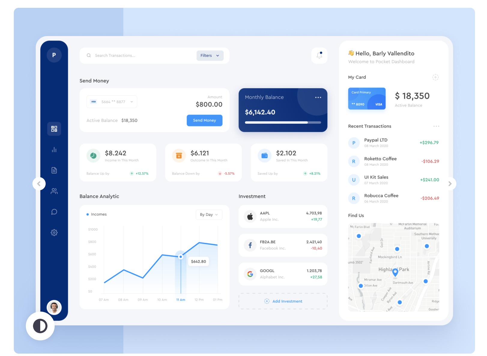

# TO-ONE-PROJECT
時間をかけて調べたリンクが散らばらず一つにまとめられるWEBアプリ・chrome拡張機能「to one」

<h3>システム概要</h3>
他人からの監視されてる感×リンク専門まとめサイト×後で見ようとしていたリンクが散らばらなくなる 
「わざわざ保存したリンク＝その人の頭の中」 
友人と自分が調べてる途中の資料などを共有できることにより、「程よい他者からの監視されてる感」を実現できます。この感覚が集中力を高めてくれます。それに加えて日頃の膨大な量の検索ページを一つにまとめることができ、「あの時間何してたんだぁ」という感覚の解消につながり、調べごとが好きな人にとってはQOLの向上が期待できます。 

<h3>要求</h3>
知識リンク共有特化型SNSです。主な機能は、検索したwebページのリンクを保存できること、それを友人間で共有できること、chrome拡張機能として使えるため即時的にリンクを保存できる。

<理想>
ローカルに自動でリンクが保存されているイメージ（オフライン可）
問題点
MacとWindowsで処理が異なる？？webアプリからローカルディレクトリに保存するアクションができるのか問題

<h3>最低限のアプリ</h3>
Djangoで簡易ユーザ管理システム構築後Herokuへデプロイ

<h3>アイデア</h3>
解析学　「他の人はこの記事を保存しています」というリコメンドシステム

<h3>不安点・メモ</h3>
Webフレームどれ使うべき問題 
なぜそのフレームワークを使ったかが大事 
絶対聞かれる 
将来的にリコメンドシステムを導入するため、pythonはNLPに適してるため 
DJANGOでいけそう？？ 
リンクを保存するアプリは著作権に抵触する？ 
StudyPlus感のUIが理想 
Google chromeとWEB APPはリンクできるのか？ 
Chromeの拡張機能の方が良い説？？(エッジが効いてて良い) 
ディレクトリ構造にすべきか問題 
Webアプリ上にディレクトリ構造を作ること＝クラウド？？ 
Webアプリとローカル環境の連結どうするのか問題浮上 
AWS上に置くべき？？ 
無料の何かがあるか？？？ 

<h3>動作説明(仕様書)</h3>
検索ページでポップを出し「to one」をクリック後、winndowが出てどのディレクトリに記事を入れるか、名前を変更するか(変更しなければ記事の名前で保存)、

<h3>使用技術</h3>
Python, Django, HTML, CSS, Javascript, Chromeブラウザ

<h3>参考資料</h3>
1.Chrome拡張の作り方 (超概要)
https://qiita.com/RyBB/items/32b2a7b879f21b3edefc

2.kintoneのスレッド投稿がスマートになるChrome拡張をVue.jsで作る
https://qiita.com/RyBB/items/3f343252b0397e93050e

3.Chrome 拡張機能を作ろう前提知識＆ウォーミングアップ編
http://www2.kobe-u.ac.jp/~tnishida/programming/ChromeExtension-01.html

4.Notionリンク
https://seleck.cc/1455

<h3>UI</h3>
デザインアイデア(仮)

デザインアイデア1

デザインアイデア2

